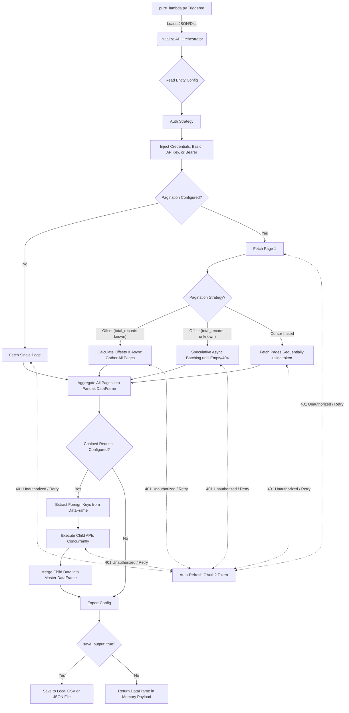

# Apiphany Configuration Data Dictionary

This document serves as the master reference for the `apiphany_config.json` schema.

## Execution Flowchart

---

## Data Dictionary: `api_config` (Root Level)
The root object is a list of entity configurations.

| Attribute | Type | Description |
| :--- | :--- | :--- |
| `entity_name` | `string` | **Required.** The unique identifier for the target system (e.g., `"stripe"`, `"salesforce"`). |
| `client_credentials` | `dict` | **Optional.** Key-value pairs used for generic credential injection via `{{templating}}`. |
| `certificates` | `dict` | **Optional.** Defines MTLS certs. Options: `cert` (path), `key` (path), `pem` (path). |
| `retry_config` | `dict` | **Optional.** See below. |
| `auth_strategy` | `dict` | **Optional.** See below. |
| `api_list` | `list` | **Required.** Array of endpoints to execute. See below. |

---

## Data Dictionary: `retry_config`

| Attribute | Type | Description |
| :--- | :--- | :--- |
| `total_retries` | `int` | Maximum number of retry attempts on 429/5xx errors. Default: `3`. |
| `backoff_factor` | `float` | Exponential backoff multiplier (e.g., `2.0` means 2s, 4s, 8s). |
| `requests_per_second` | `int` | Hard limit on concurrency to avoid triggering API rate limits. |

---

## Data Dictionary: `auth_strategy`

| Attribute | Type | Description |
| :--- | :--- | :--- |
| `type` | `enum` | `"oauth2_client_credentials"`, `"basic"`, `"bearer_static"`. |
| `method` | `string` | `"POST"` or `"GET"` for fetching the token. |
| `url` | `string` | The endpoint to hit to receive the Bearer token. |
| `payload` | `dict` | Form-data or JSON body to send for auth. |
| `token_extractor_path` | `string` | The dot-notation path to extract the token from the response (e.g. `"data.access_token"`). |

---

## Data Dictionary: `api_list` (Endpoint Level)

| Attribute | Type | Description |
| :--- | :--- | :--- |
| `api_identifier` | `string` | **Required.** Unique ID for this endpoint (e.g., `"get_users"`). |
| `api_name` | `string` | Human-readable name for logging. |
| `method` | `enum` | `"GET"`, `"POST"`, `"PUT"`. |
| `url` | `string` | **Required.** The target URL (supports `{{variable}}` injection). |
| `auth_type` | `enum` | `"bearer"`, `"basic"`, `"None"`. |
| `query_params` | `dict` | URL query strings to append. Supports templating. |
| `pagination` | `dict` | **Optional.** See below. |
| `extractor_config` | `dict` | **Optional.** See below. |
| `chained_request` | `dict` | **Optional.** Triggers a child API automatically. See below. |
| `export_config` | `dict` | **Optional.** Defines how the output is saved. |

---

## Data Dictionary: `pagination`

| Attribute | Type | Description |
| :--- | :--- | :--- |
| `type` | `enum` | `"page_based"`, `"offset_based"`, `"cursor_based"`. |
| `page_key` / `offset_key` | `string` | The query parameter name for the page/offset (e.g., `"page"`). |
| `cursor_key` | `string` | The query parameter name for the cursor (e.g., `"next_page_token"`). |
| `extractor_path` | `string` | For cursor-based: where in the JSON response to find the next token. |
| `stop_condition` | `enum` | `"no_data"`, `"null_cursor"`. When to halt pagination. |
| `total_records_path` | `string` | **Optional.** Dot-notation path to extract total record count from the first API response (e.g., `"metadata.total_records"`). If provided with offset-based pagination, triggers massive concurrent fan-out for the remaining pages. If omitted, engine uses "Speculative Windowing" to fire batches of offsets asynchronously until an empty payload or 404 is hit. |
| `max_concurrent_requests` | `int` | **Optional.** Number of concurrent requests to spawn for offset-calculation or speculative batching (default: `10`). |

---

## Data Dictionary: `extractor_config`

| Attribute | Type | Description |
| :--- | :--- | :--- |
| `response_data_extractor` | `string` | Dot-notation path to the array of records (e.g., `"data.results"`). |
| `json_extract_config` | `dict` | Defines `desired_columns` (list of strings) and `simplify_columns` (boolean to auto-flatten nested objects). |

---

## Data Dictionary: `chained_request`

| Attribute | Type | Description |
| :--- | :--- | :--- |
| `child_api_identifier` | `string` | **Required.** The `api_identifier` of the child API to trigger. |
| `key_mapping` | `dict` | **Required.** Maps a column from the Parent DataFrame to a variable in the Child API (e.g., `{"parent_id": "child_query_id"}`). |
| `max_concurrent_requests` | `int` | How many child APIs to run concurrently via `asyncio`. |
| `batch_size` | `int` | Groups multiple parent IDs into a single comma-separated child API request (e.g. `?userId=1,2,3,4,5`). Dramatically reduces the total number of API calls and limits hitting rate restrictions. |
